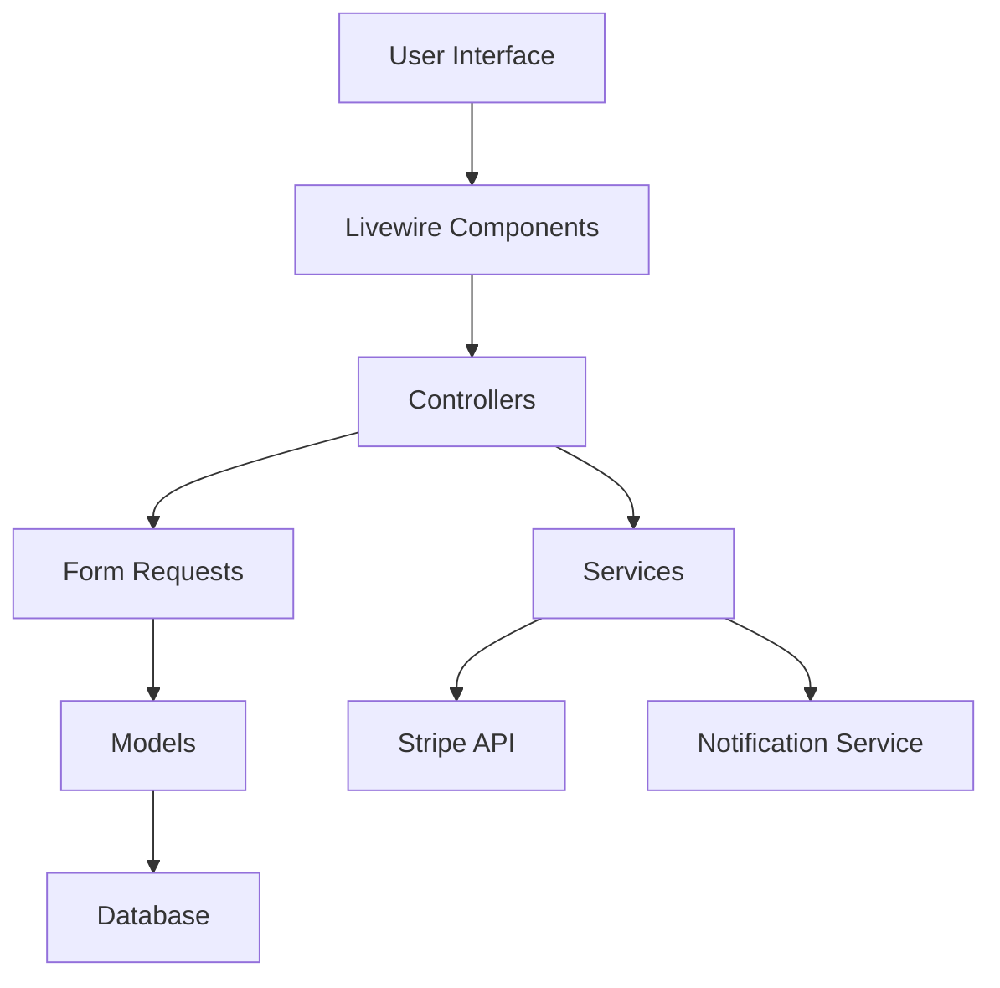

# Design Document for Yoga & Pilates Reservation System

## Overview

### English
This design document outlines the architecture for the Yoga & Pilates Reservation System, focusing on Phase 2 (Subscription System) and Phase 3 (Reservation System) implementation. The system builds upon the completed Phase 1 foundation, which includes user authentication, role-based access control, and basic CRUD operations for administrative entities.

The design follows Laravel best practices and leverages existing patterns established in Phase 1, ensuring consistency and maintainability.

### 日本語
この設計ドキュメントは、ヨガ・ピラティス予約システムのアーキテクチャを概説し、Phase 2（月謝システム）とPhase 3（予約システム）の実装に焦点を当てています。このシステムは、ユーザー認証、ロールベースのアクセス制御、管理エンティティの基本的なCRUD操作を含む完了したPhase 1の基盤を基に構築されています。

設計はLaravelのベストプラクティスに従い、Phase 1で確立された既存のパターンを活用し、一貫性と保守性を確保します。

## Steering Document Alignment

### Technical Standards (Laravel Best Practices)

#### English
The design follows established Laravel conventions:
- **MVC Architecture**: Separation of concerns with Controllers, Models, and Views
- **Repository Pattern**: Data access layer abstraction (to be implemented)
- **Form Request Validation**: Centralized validation with custom error messages
- **Resource Controllers**: RESTful routing with standard CRUD operations
- **Eloquent Relationships**: Proper model relationships and eager loading

#### 日本語
設計は確立されたLaravelの慣習に従います：
- **MVCアーキテクチャ**: コントローラー、モデル、ビューによる関心の分離
- **リポジトリパターン**: データアクセス層の抽象化（実装予定）
- **Form Request検証**: カスタムエラーメッセージによる集中化された検証
- **リソースコントローラー**: RESTfulルーティングによる標準的なCRUD操作
- **Eloquentリレーションシップ**: 適切なモデルリレーションシップとeager loading

### Project Structure (Laravel 12 Standards)

#### English
Following Laravel 12's streamlined structure:
- **Route Registration**: Using `bootstrap/app.php` for middleware and routing
- **Service Providers**: Application-specific providers in `bootstrap/providers.php`
- **Auto-registration**: Console commands and other classes auto-registered
- **Migration Organization**: Clear migration naming and proper foreign key constraints

#### 日本語
Laravel 12の合理化された構造に従います：
- **ルート登録**: `bootstrap/app.php`を使用したミドルウェアとルーティング
- **サービスプロバイダー**: `bootstrap/providers.php`でのアプリケーション固有のプロバイダー
- **自動登録**: コンソールコマンドなどのクラスが自動登録
- **マイグレーション構成**: 明確なマイグレーション命名と適切な外部キー制約

## Code Reuse Analysis

### Existing Components to Leverage

#### **Admin CRUD Controllers Pattern**

##### English
- **StoreController, LessonController, etc.**: Standard CRUD operations with Japanese status messages
- **Reusability**: New controllers (ReservationController, SubscriptionController) will follow this exact pattern
- **Benefits**: Consistent error handling, redirect patterns, and user feedback

##### 日本語
- **StoreController, LessonController, etc.**: 日本語ステータスメッセージを使用した標準的なCRUD操作
- **再利用性**: 新しいコントローラー（ReservationController, SubscriptionController）はこのパターンを正確に使用
- **利点**: 一貫したエラーハンドリング、リダイレクトパターン、ユーザーへのフィードバック

#### **Form Request Validation Pattern**

##### English
- **StoreStoreRequest, UpdateStoreRequest**: Japanese attribute names, custom validation rules
- **Reusability**: All new forms will use this pattern for Japanese localization
- **Benefits**: Consistent validation messages and user experience

##### 日本語
- **StoreStoreRequest, UpdateStoreRequest**: 日本語属性名、カスタム検証ルール
- **再利用性**: すべての新しいフォームは日本語ローカライズのためにこのパターンを使用
- **利点**: 一貫した検証メッセージとユーザーエクスペリエンス

#### **Model Relationships and Scopes**

##### English
- **Store model**: HasMany relationships, Active scope, accessor methods
- **Reusability**: New models will follow this pattern for data relationships
- **Benefits**: Standardized data access and business logic encapsulation

##### 日本語
- **Storeモデル**: HasManyリレーションシップ、Activeスコープ、アクセサーメソッド
- **再利用性**: 新しいモデルはこのパターンをデータリレーションシップに使用
- **利点**: 標準化されたデータアクセスとビジネスロジックの隠蔽化

#### **Authentication and Authorization**

##### English
- **Laravel Breeze**: User registration, login, password reset
- **Gate-based Permissions**: `access-admin`, `access-instructor` gates
- **Reusability**: All new features will integrate with existing auth system
- **Benefits**: Centralized security and consistent user management

##### 日本語
- **Laravel Breeze**: ユーザー登録、ログイン、パスワードリセット
- **Gateベースのパーミッション**: `access-admin`, `access-instructor` ゲート
- **再利用性**: すべての新しい機能は既存の認証システムと統合
- **利点**: 集中化されたセキュリティと一貫したユーザー管理

### Integration Points

#### **Database Layer**

##### English
- **Existing Tables**: All Phase 1 tables (users, stores, lessons, etc.)
- **New Tables**: subscription_plans, user_subscriptions, reservations (Phase 2-3)
- **Integration**: Foreign key relationships to existing entities

##### 日本語
- **既存テーブル**: Phase 1のすべてのテーブル（users, stores, lessonsなど）
- **新規テーブル**: subscription_plans, user_subscriptions, reservations（Phase 2-3）
- **統合**: 既存エンティティへの外部キー関係

#### **Frontend Layer**

##### English
- **Blade Templates**: Admin interface consistency
- **Livewire Components**: Interactive features (to be added in Phase 3)
- **Tailwind CSS**: Consistent styling patterns

##### 日本語
- **Bladeテンプレート**: 管理画面インターフェースの一貫性
- **Livewireコンポーネント**: インタラクティブ機能（Phase 3で追加予定）
- **Tailwind CSS**: 一貫したスタイリングパターン

## Architecture

### English
The system follows a layered architecture with clear separation of concerns:

### 日本語
システムは明確な関心の分離によるレイヤーアーキテクチャに従います：

### Modular Design Principles

#### **Controller Layer**

##### English
- **Single Responsibility**: Each controller handles one domain (Admin/StoreController, Admin/ReservationController)
- **Consistent Patterns**: All admin controllers follow identical CRUD structure
- **Error Handling**: Centralized exception handling with user-friendly messages

##### 日本語
- **単一責任**: 各コントローラーは1つのドメインを扱う（Admin/StoreController, Admin/ReservationController）
- **一貫したパターン**: すべての管理コントローラーは同一のCRUD構造に従う
- **エラーハンドリング**: ユーザーフレンドリーなメッセージによる集中化された例外処理

#### **Model Layer**

##### English
- **Eloquent Relationships**: Proper relationship definitions with foreign keys
- **Business Logic**: Scopes and accessors for data manipulation
- **Validation**: Model-level constraints and data integrity

##### 日本語
- **Eloquentリレーションシップ**: 外部キーによる適切なリレーションシップ定義
- **ビジネスロジック**: データ操作のためのスコープとアクセサー
- **検証**: モデルレベルの制約とデータ整合性

#### **Service Layer (Future Implementation)**

##### English
- **Business Logic Separation**: Complex operations moved to service classes
- **API Integration**: Stripe payment processing, notification sending
- **Data Transformation**: DTOs for API responses

##### 日本語
- **ビジネスロジックの分離**: 複雑な操作をサービスクラスに移動
- **API統合**: Stripe決済処理、通知送信
- **データ変換**: APIレスポンスのためのDTO

#### **Frontend Layer**

##### English
- **Component Isolation**: Each feature as separate Livewire component
- **Responsive Design**: Mobile-first approach with PC optimization
- **Progressive Enhancement**: Basic functionality without JavaScript

##### 日本語
- **コンポーネント分離**: 各機能を個別のLivewireコンポーネントとして
- **レスポンシブデザイン**: モバイルファーストアプローチとPC最適化
- **プログレッシブエンハンスメント**: JavaScriptなしでの基本機能



## Components and Interfaces

### Admin Reservation Management Component

#### English
- **Purpose**: Manage lesson reservations with filtering and status updates
- **Interfaces**:
  - `index()`: List reservations with filtering
  - `show($reservation)`: Display reservation details
  - `update(Request $request, Reservation $reservation)`: Update reservation status
- **Dependencies**: Reservation model, LessonSchedule model, User model
- **Reuses**: Admin CRUD pattern from existing controllers

#### 日本語
- **目的**: フィルタリングとステータス更新によるレッスン予約の管理
- **インターフェース**:
  - `index()`: フィルタリング付き予約一覧表示
  - `show($reservation)`: 予約詳細表示
  - `update(Request $request, Reservation $reservation)`: 予約ステータス更新
- **依存関係**: Reservationモデル、LessonScheduleモデル、Userモデル
- **再利用**: 既存コントローラーのAdmin CRUDパターン

### User Reservation Component (Livewire)

#### English
- **Purpose**: Allow users to book lessons according to their subscription
- **Interfaces**:
  - `render()`: Display available lessons
  - `bookLesson($scheduleId)`: Process lesson booking
  - `cancelReservation($reservationId)`: Cancel existing reservation
- **Dependencies**: UserSubscription model, LessonSchedule model, Reservation model
- **Reuses**: Livewire component patterns (to be established)

#### 日本語
- **目的**: ユーザーがサブスクリプションに応じてレッスンを予約できるようにする
- **インターフェース**:
  - `render()`: 利用可能なレッスン表示
  - `bookLesson($scheduleId)`: レッスン予約処理
  - `cancelReservation($reservationId)`: 既存予約のキャンセル
- **依存関係**: UserSubscriptionモデル、LessonScheduleモデル、Reservationモデル
- **再利用**: Livewireコンポーネントパターン（確立予定）

### Subscription Management Component

#### English
- **Purpose**: Handle user subscriptions and Stripe integration
- **Interfaces**:
  - `createCheckoutSession($planId)`: Create Stripe checkout session
  - `handleWebhook(Request $request)`: Process Stripe webhooks
  - `cancelSubscription($subscriptionId)`: Cancel user subscription
- **Dependencies**: Laravel Cashier, SubscriptionPlan model, User model
- **Reuses**: Admin controller patterns for CRUD operations

#### 日本語
- **目的**: ユーザーサブスクリプションとStripe統合を処理
- **インターフェース**:
  - `createCheckoutSession($planId)`: Stripeチェックアウトセッション作成
  - `handleWebhook(Request $request)`: Stripe Webhook処理
  - `cancelSubscription($subscriptionId)`: ユーザーサブスクリプションキャンセル
- **依存関係**: Laravel Cashier、SubscriptionPlanモデル、Userモデル
- **再利用**: CRUD操作のためのAdminコントローラーパターン

### Notification Service Component

#### English
- **Purpose**: Send notifications for reservations and subscriptions
- **Interfaces**:
  - `sendReservationConfirmation(Reservation $reservation)`: Send booking confirmation
  - `sendReminder(Reservation $reservation)`: Send 24-hour reminder
  - `sendSubscriptionUpdate(UserSubscription $subscription)`: Send subscription changes
- **Dependencies**: NotificationTemplate model, Mail service
- **Reuses**: Template variable substitution from existing system

#### 日本語
- **目的**: 予約とサブスクリプションに関する通知を送信
- **インターフェース**:
  - `sendReservationConfirmation(Reservation $reservation)`: 予約確認送信
  - `sendReminder(Reservation $reservation)`: 24時間前のリマインダー送信
  - `sendSubscriptionUpdate(UserSubscription $subscription)`: サブスクリプション変更送信
- **依存関係**: NotificationTemplateモデル、Mailサービス
- **再利用**: 既存システムからのテンプレート変数置換

### Instructor Profile Management Component

#### English
- **Purpose**: Manage instructor-specific profile data (image, bio, qualifications, notes)
- **Interfaces**:
  - `show($user)`: Display instructor profile
  - `edit($user)`: Edit instructor profile form
  - `update(Request $request, $user)`: Update instructor profile
  - `store(Request $request, $user)`: Create instructor profile (admin only)
  - `destroy($user)`: Delete instructor profile (admin only)
- **Dependencies**: InstructorProfile model, User model, Storage service
- **Reuses**: Admin CRUD pattern, Form Request validation pattern

#### 日本語
- **目的**: インストラクター固有のプロフィールデータ（画像、自己紹介、資格、備考）を管理
- **インターフェース**:
  - `show($user)`: インストラクタープロフィール表示
  - `edit($user)`: インストラクタープロフィール編集フォーム
  - `update(Request $request, $user)`: インストラクタープロフィール更新
  - `store(Request $request, $user)`: インストラクタープロフィール作成（管理者のみ）
  - `destroy($user)`: インストラクタープロフィール削除（管理者のみ）
- **依存関係**: InstructorProfileモデル、Userモデル、Storageサービス
- **再利用**: Admin CRUDパターン、Form Request検証パターン

## Data Models

### Reservation Model

#### English
```php
class Reservation extends Model
{
    protected $fillable = [
        'user_id',
        'lesson_schedule_id',
        'user_subscription_id',
        'status',
        'reserved_at'
    ];

    protected $casts = [
        'reserved_at' => 'datetime',
        'status' => ReservationStatus::class
    ];

    public function user(): BelongsTo
    public function lessonSchedule(): BelongsTo
    public function userSubscription(): BelongsTo

    public function scopeActive($query)
    public function scopeByUser($query, $userId)
    public function scopeByDate($query, $date)
}
```

#### 日本語
```php
class Reservation extends Model
{
    protected $fillable = [
        'user_id',           // ユーザーID
        'lesson_schedule_id', // レッスンスケジュールID
        'user_subscription_id', // ユーザーサブスクリプションID
        'status',            // 予約ステータス
        'reserved_at'        // 予約日時
    ];

    protected $casts = [
        'reserved_at' => 'datetime',           // 日時型変換
        'status' => ReservationStatus::class  // ステータス列挙型
    ];

    public function user(): BelongsTo           // ユーザーとの関連
    public function lessonSchedule(): BelongsTo // スケジュールとの関連
    public function userSubscription(): BelongsTo // サブスクリプションとの関連

    public function scopeActive($query)         // 有効予約スコープ
    public function scopeByUser($query, $userId) // ユーザー別スコープ
    public function scopeByDate($query, $date)   // 日付別スコープ
}
```

### UserSubscription Model
#### English
```php
class UserSubscription extends Model
{
    protected $fillable = [
        'user_id',
        'plan_id',
        'stripe_subscription_id',
        'status',
        'payment_status',
        'current_period_start',
        'current_period_end',
        'current_month_used_count'
    ];

    protected $casts = [
        'current_period_start' => 'datetime',
        'current_period_end' => 'datetime',
        'status' => SubscriptionStatus::class
    ];

    public function user(): BelongsTo
    public function plan(): BelongsTo
    public function reservations(): HasMany

    public function scopeActive($query)
    public function scopeByUser($query, $userId)
    public function canBookLesson(): bool
}
```

#### 日本語
```php
class UserSubscription extends Model
{
    protected $fillable = [
        'user_id',                // ユーザーID
        'plan_id',                // プランID
        'stripe_subscription_id', // StripeサブスクリプションID
        'status',                 // サブスクリプションステータス
        'payment_status',         // 決済ステータス
        'current_period_start',   // 現在の期間開始日
        'current_period_end',     // 現在の期間終了日
        'current_month_used_count' // 当月の利用回数
    ];

    protected $casts = [
        'current_period_start' => 'datetime',         // 期間開始日時変換
        'current_period_end' => 'datetime',           // 期間終了日時変換
        'status' => SubscriptionStatus::class        // ステータス列挙型
    ];

    public function user(): BelongsTo          // ユーザーとの関連
    public function plan(): BelongsTo           // プランとの関連
    public function reservations(): HasMany     // 予約との関連

    public function scopeActive($query)         // 有効サブスクリプションスコープ
    public function scopeByUser($query, $userId) // ユーザー別スコープ
    public function canBookLesson(): bool       // レッスン予約可能判定
}
```

### LessonSchedule Model (Extension)

#### English
```php
class LessonSchedule extends Model
{
    // Existing properties...

    public function reservations(): HasMany
    public function availableSlots(): int
    public function isFullyBooked(): bool
    public function canUserBook(User $user): bool
}
```

#### 日本語
```php
class LessonSchedule extends Model
{
    // 既存のプロパティ...

    public function reservations(): HasMany      // 予約との関連
    public function availableSlots(): int        // 利用可能な枠数取得
    public function isFullyBooked(): bool        // 満員判定
    public function canUserBook(User $user): bool // ユーザー予約可能判定
}
```

### InstructorProfile Model

#### English
```php
class InstructorProfile extends Model
{
    protected $fillable = [
        'user_id',           // User ID (unique, FK to users.id)
        'image_path',        // Profile image path (nullable)
        'bio',               // Self-introduction (nullable)
        'qualifications',    // Qualifications (newline-separated, nullable)
        'notes'              // Notes (nullable)
    ];

    protected $casts = [
        'user_id' => 'integer'
    ];

    public function user(): BelongsTo
    {
        return $this->belongsTo(User::class);
    }

    public function getImageUrlAttribute(): ?string
    {
        return $this->image_path ? Storage::disk('public')->url($this->image_path) : null;
    }

    public function getQualificationsArrayAttribute(): array
    {
        return $this->qualifications ? explode("\n", $this->qualifications) : [];
    }
}
```

#### 日本語
```php
class InstructorProfile extends Model
{
    protected $fillable = [
        'user_id',           // ユーザーID（一意、users.idへの外部キー）
        'image_path',        // プロフィール画像パス（nullable）
        'bio',               // 自己紹介（nullable）
        'qualifications',    // 資格（改行区切り、nullable）
        'notes'              // 備考（nullable）
    ];

    protected $casts = [
        'user_id' => 'integer'
    ];

    public function user(): BelongsTo
    {
        return $this->belongsTo(User::class);
    }

    public function getImageUrlAttribute(): ?string
    {
        return $this->image_path ? Storage::disk('public')->url($this->image_path) : null;
    }

    public function getQualificationsArrayAttribute(): array
    {
        return $this->qualifications ? explode("\n", $this->qualifications) : [];
    }
}
```

### User Model (Extension for Instructor Profile)

#### English
```php
class User extends Authenticatable
{
    // Existing properties...

    public function instructorProfile(): HasOne
    {
        return $this->hasOne(InstructorProfile::class);
    }

    public function isInstructor(): bool
    {
        return $this->role === 'instructor';
    }

    public function hasInstructorProfile(): bool
    {
        return $this->instructorProfile !== null;
    }
}
```

#### 日本語
```php
class User extends Authenticatable
{
    // 既存のプロパティ...

    public function instructorProfile(): HasOne
    {
        return $this->hasOne(InstructorProfile::class);
    }

    public function isInstructor(): bool
    {
        return $this->role === 'instructor';
    }

    public function hasInstructorProfile(): bool
    {
        return $this->instructorProfile !== null;
    }
}
```

## Error Handling

### Error Scenarios

#### English
1. **Double Booking Prevention**
   - **Description**: Multiple users attempting to book the same slot simultaneously
   - **Handling**: Database-level unique constraints, optimistic locking
   - **User Impact**: "このレッスンは満員です" message with alternative suggestions

2. **Subscription Limit Exceeded**
   - **Description**: User attempts to book beyond monthly limit
   - **Handling**: Pre-validation in booking process
   - **User Impact**: "今月の予約上限を超えています" with remaining quota display

3. **Stripe Payment Failure**
   - **Description**: Payment processing fails during subscription creation
   - **Handling**: Webhook error handling, retry mechanism, user notification
   - **User Impact**: Clear error message with retry options

4. **Schedule Cancellation**
   - **Description**: Admin cancels lesson schedule with existing reservations
   - **Handling**: Automated notification to affected users, refund processing
   - **User Impact**: Email notification with rescheduling options

5. **Instructor Profile Image Upload Failure**
   - **Description**: Image upload fails due to size/format restrictions
   - **Handling**: Form validation with clear error messages
   - **User Impact**: "画像のアップロードに失敗しました。jpg/png/webp形式、10MB以下でお試しください"

6. **Unauthorized Profile Access**
   - **Description**: Non-instructor or non-admin attempts to access instructor profile
   - **Handling**: Authorization middleware and policy checks
   - **User Impact**: 403 Forbidden with appropriate error page

#### 日本語
1. **二重予約防止**
   - **説明**: 複数のユーザーが同時に同じ枠を予約しようとする
   - **処理**: データベースレベルの一意制約、楽観的ロック
   - **ユーザーへの影響**: 「このレッスンは満員です」というメッセージと代替案の提案

2. **サブスクリプション制限超過**
   - **説明**: ユーザーが月間制限を超えて予約しようとする
   - **処理**: 予約プロセスでの事前検証
   - **ユーザーへの影響**: 「今月の予約上限を超えています」と残りのクォータ表示

3. **Stripe決済失敗**
   - **説明**: サブスクリプション作成時の決済処理が失敗する
   - **処理**: Webhookエラーハンドリング、リトライメカニズム、ユーザー通知
   - **ユーザーへの影響**: 明確なエラーメッセージとリトライオプション

4. **スケジュールキャンセル**
   - **説明**: 管理者が既存の予約があるレッスンスケジュールをキャンセルする
   - **処理**: 影響を受けるユーザーへの自動通知、返金処理
   - **ユーザーへの影響**: 再スケジュールのオプション付きメール通知

5. **インストラクタープロフィール画像アップロード失敗**
   - **説明**: 画像サイズ/形式制限によるアップロード失敗
   - **処理**: 明確なエラーメッセージによるフォーム検証
   - **ユーザーへの影響**: 「画像のアップロードに失敗しました。jpg/png/webp形式、10MB以下でお試しください」

6. **不正なプロフィールアクセス**
   - **説明**: インストラクター以外または管理者以外がインストラクタープロフィールにアクセス
   - **処理**: 認可ミドルウェアとポリシーチェック
   - **ユーザーへの影響**: 適切なエラーページ付きの403 Forbidden

## Testing Strategy

### Unit Testing

#### English
- **Models**: Relationship definitions, scope methods, accessor methods
- **Services**: Business logic validation, Stripe API integration
- **Form Requests**: Validation rules, authorization checks
- **InstructorProfile**: Image URL generation, qualifications array conversion

#### 日本語
- **モデル**: リレーションシップ定義、スコープメソッド、アクセサーメソッド
- **サービス**: ビジネスロジック検証、Stripe API統合
- **Form Request**: 検証ルール、認可チェック
- **InstructorProfile**: 画像URL生成、資格配列変換

### Integration Testing

#### English
- **Reservation Flow**: Complete booking process from selection to confirmation
- **Subscription Flow**: Plan selection through Stripe checkout completion
- **Admin Operations**: CRUD operations with proper authorization
- **Instructor Profile Flow**: Profile creation, editing, image upload, authorization checks

#### 日本語
- **予約フロー**: 選択から確認までの完全な予約プロセス
- **サブスクリプションフロー**: プラン選択からStripeチェックアウト完了まで
- **管理者操作**: 適切な認可によるCRUD操作
- **インストラクタープロフィールフロー**: プロフィール作成、編集、画像アップロード、認可チェック

### End-to-End Testing

#### English
- **User Registration to Booking**: Complete user journey
- **Admin Management**: Studio and lesson management workflows
- **Subscription Lifecycle**: Plan changes, cancellations, renewals
- **Instructor Profile Management**: Complete profile lifecycle from creation to deletion

#### 日本語
- **ユーザー登録から予約まで**: 完全なユーザー体験
- **管理者管理**: スタジオとレッスンの管理ワークフロー
- **サブスクリプションライフサイクル**: プラン変更、キャンセル、更新
- **インストラクタープロフィール管理**: 作成から削除までの完全なプロフィールライフサイクル

## Security Considerations

### Authentication & Authorization

#### English
- **Role-based Access**: Admin, Instructor, User roles with appropriate permissions
- **Gate Definitions**: Centralized permission checks in service providers
- **Session Security**: HTTPS-only, secure cookies, CSRF protection
- **Instructor Profile Access**: Only instructors can edit their own profiles, admins can manage all profiles

#### 日本語
- **ロールベースアクセス**: Admin、Instructor、Userロールに適切な権限
- **Gate定義**: サービスプロバイダーでの集中化された権限チェック
- **セッションセキュリティ**: HTTPS専用、セキュアクッキー、CSRF保護
- **インストラクタープロフィールアクセス**: インストラクターは自分のプロフィールのみ編集可能、管理者は全プロフィール管理可能

### Data Validation

#### English
- **Form Requests**: All input validation with Japanese error messages
- **SQL Injection Prevention**: Eloquent ORM with parameterized queries
- **XSS Prevention**: Blade template escaping, input sanitization
- **Image Upload Security**: File type validation, size limits, secure storage paths

#### 日本語
- **Form Request**: 日本語エラーメッセージによるすべての入力検証
- **SQLインジェクション防止**: パラメータ化クエリを使用したEloquent ORM
- **XSS防止**: Bladeテンプレートエスケープ、入力サニタイズ
- **画像アップロードセキュリティ**: ファイルタイプ検証、サイズ制限、セキュアなストレージパス

### Payment Security

#### English
- **Stripe Integration**: No sensitive payment data stored locally
- **Webhook Verification**: Signature validation for Stripe webhooks
- **Audit Trail**: Subscription changes logged for compliance

#### 日本語
- **Stripe統合**: 機密性の高い決済データをローカルに保存しない
- **Webhook検証**: Stripe Webhookの署名検証
- **監査証跡**: コンプライアンスのためのサブスクリプション変更ログ

## Performance Optimization

### Database Optimization

#### English
- **Indexing**: Proper indexes on frequently queried columns
- **Eager Loading**: Prevent N+1 queries in reservation listings
- **Query Optimization**: Efficient queries for schedule availability

#### 日本語
- **インデックス**: 頻繁にクエリされるカラムに適切なインデックス
- **Eager Loading**: 予約一覧でのN+1クエリ防止
- **クエリ最適化**: スケジュール可用性のための効率的なクエリ

### Caching Strategy

#### English
- **Settings Cache**: System settings cached for performance
- **Schedule Cache**: Popular lesson schedules cached
- **User Data**: User subscription status cached

#### 日本語
- **設定キャッシュ**: パフォーマンスのためのシステム設定キャッシュ
- **スケジュールキャッシュ**: 人気のレッスンスケジュールをキャッシュ
- **ユーザーデータ**: ユーザーサブスクリプションステータスをキャッシュ

### API Rate Limiting

#### English
- **Booking Limits**: Prevent abuse of booking endpoints
- **Admin Operations**: Rate limiting on bulk operations
- **Stripe Integration**: Respect API rate limits

#### 日本語
- **予約制限**: 予約エンドポイントの悪用防止
- **管理者操作**: 一括操作でのレート制限
- **Stripe統合**: APIレート制限の遵守
